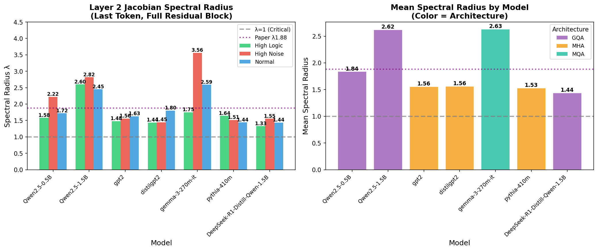
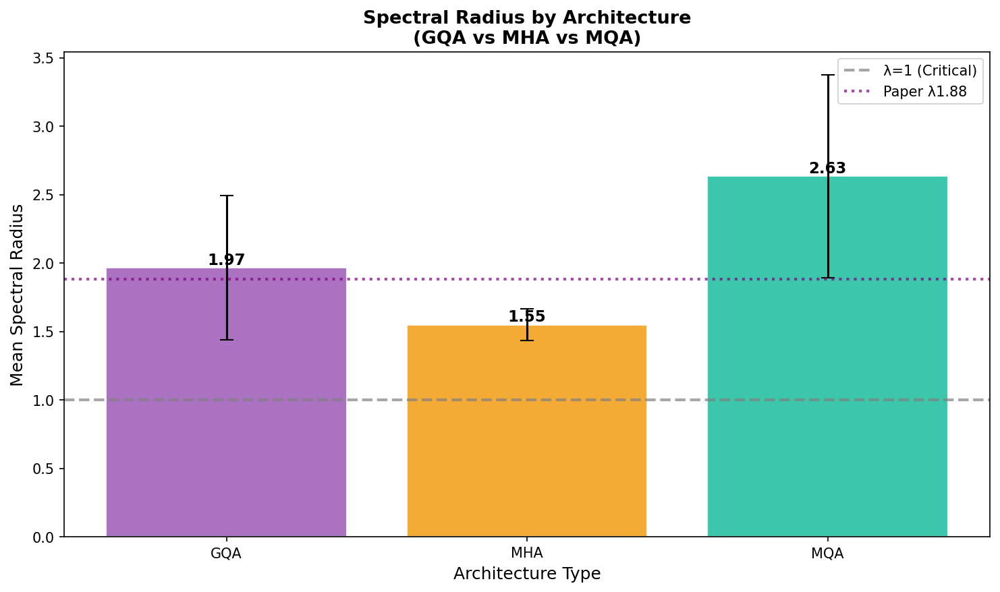
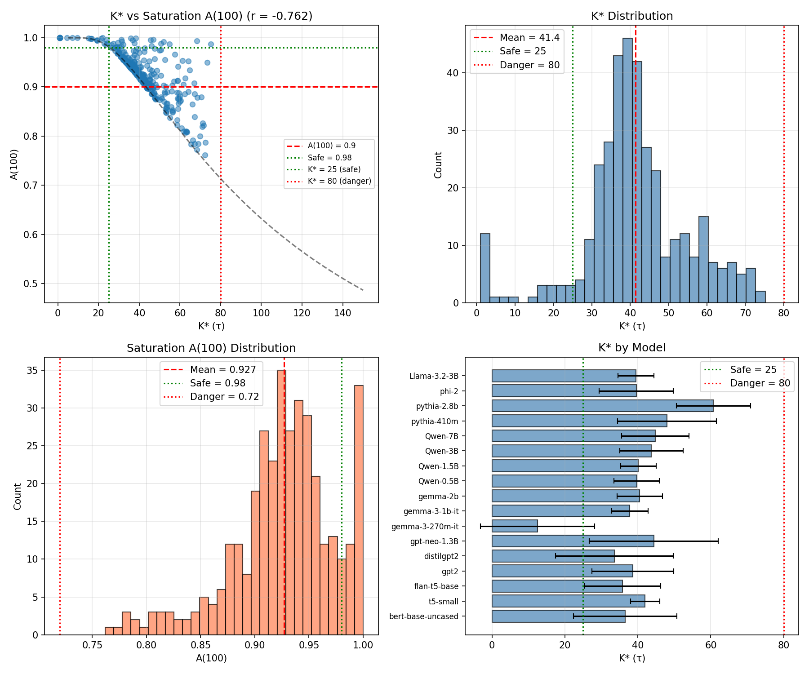
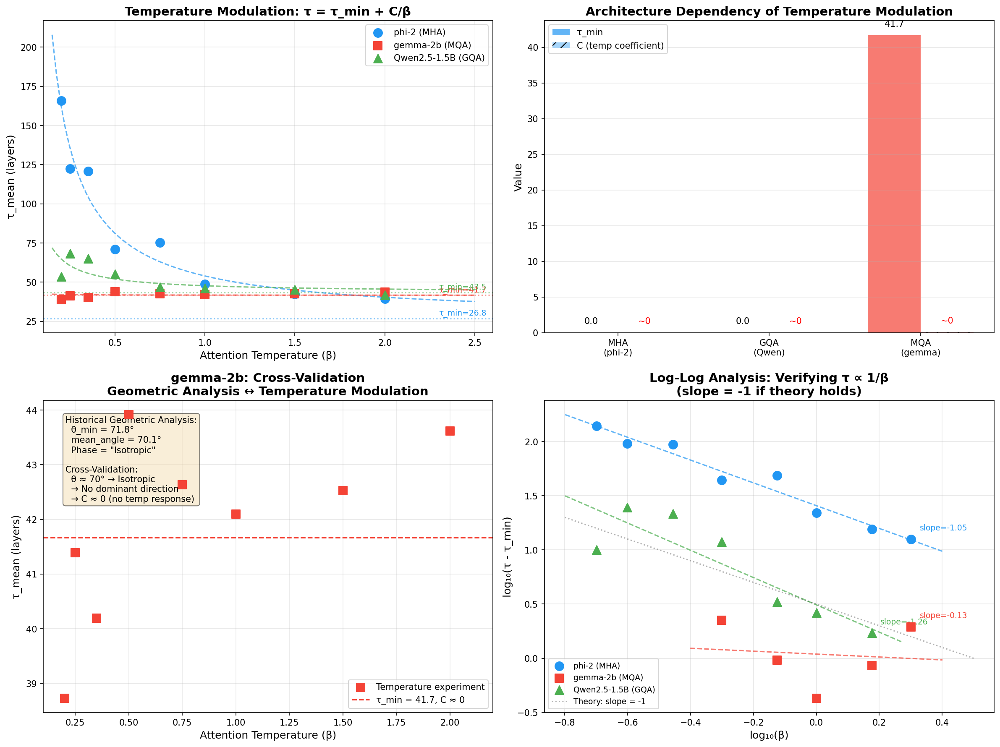

# StateLens: The Transformer Expansion System

**[中文版 (Chinese Version)](README_CN.md)**

[](https://doi.org/10.5281/zenodo.18948375)

> **Attention determines mixing modes, embedding determines observable modes, logits reflect filtered dynamics.**

## Overview

This repository contains the experimental data and analysis code for our comprehensive study of Transformer internal dynamics. We present evidence that Transformer layers operate as **expansive systems** (Layer 2 λ ≈ 1.7-1.8 > 1), challenging the conventional assumption of contractive representation learning.

## Key Findings

### 1. Transformer Layers are Expansive Systems
- Spectral radius Layer 2 λ ≈ 1.7-1.8 > 1 across 15+ models
- Stability emerges from LayerNorm, not weight contraction

### 2. K-θ Monotonicity Law
- Geometric alignment follows: cos(θ_k) = c_0 + c_1(1 - e^{-k/τ})
- Validated across 15 models, K ∈ [1, 512], zero exceptions

### 3. Temperature Modulation: τ = τ_min + C/β
- Architecture-dependent temperature response
- MHA: Strong (C ≈ 27), GQA: Moderate (C ≈ 4), MQA: None (C ≈ 0)

### 4. SI Classification: Continuous Spectrum
- LP (Low Perturbation) → SP (Spectral Perturbation) → OSC (Oscillatory)
- No phase transitions, smooth continuous crossover

## Key Figures

### Layer 2 Spectral Radius Analysis

*Layer 2 Jacobian spectral radius across 7 models and 3 input distributions. All models show λ > 1 (expansion).*

### Architecture Comparison

*Mean spectral radius by attention architecture type (GQA, MHA, MQA).*

### K-θ Monotonicity Validation

*K-θ monotonicity law validated across multiple models.*

### Cross-Architecture Temperature Analysis

*Temperature modulation capacity varies by architecture type.*

## Repository Structure

```
statelens/
├── docs/
│   ├── The_Transformer_Expansion_System.md      # Paper (English)
│   ├── The_Transformer_Expansion_System.pdf     # Paper PDF (English)
│   ├── The_Transformer_Expansion_System_CN.md   # Paper (Chinese)
│   └── The_Transformer_Expansion_System_CN.pdf  # Paper PDF (Chinese)
├── scripts/
│   ├── attention_temperature_enhanced_v1.py     # Temperature experiment
│   ├── full_block_jacobian_spectrum_test.py     # Jacobian analysis
│   ├── calculate_si_all_models.py               # SI calculation
│   ├── band_sensitivity_analysis.py             # Sensitivity analysis
│   ├── pre_residual_control_experiment.py       # Negative control
│   ├── negative_control_experiment.py           # Negative control
│   ├── decisive_random_subspace_experiment.py   # Causal validation
│   └── tau_profile_likelihood.py                # Likelihood analysis
├── validation_results/
│   ├── figures/                                # Visualization figures
│   │   ├── layer2_spectral_radius_analysis.png
│   │   ├── architecture_comparison.png
│   │   ├── k_star_validation.png
│   │   └── cross_architecture_temperature_analysis.png
│   ├── layer2_jacobian_spectral_analysis.json   # Layer 2 spectral data
│   ├── layer2_spectral_results_20260311.json    # Multi-model results
│   ├── enhanced_temperature_20260310_195631.json # Temperature data
│   ├── k_star_validation_summary.json           # K-θ validation
│   ├── decisive_experiment_results.json         # Decisive experiment
│   ├── pre_residual_control.json                # Control experiment
│   ├── negative_control_perturbation.json       # Control experiment
│   └── profile_likelihood_summary.json          # Likelihood summary
└── README.md
```

## Models Studied

| Model Family | Architectures | Parameters |
|:-------------|:--------------|:-----------|
| Qwen2.5 | GQA | 0.5B, 1.5B, 3B, 7B |
| Phi-2 | MHA | 2.7B |
| Gemma | MQA | 2B |
| LLaMA | GQA | 7B |
| Pythia | MHA | Various |

## Quick Start

### Requirements

```bash
pip install torch>=2.0 transformers>=4.30 numpy scipy matplotlib
```

### Run Experiments

```python
# Example: Temperature modulation experiment
python scripts/attention_temperature_enhanced_v1.py

# Example: Jacobian spectrum analysis
python scripts/full_block_jacobian_spectrum_test.py
```

## Scripts Documentation

### Core Experiments

| Script | Function | Output |
|:-------|:---------|:-------|
| `full_block_jacobian_spectrum_test.py` | Compute Jacobian spectral radius for Transformer blocks | `layer2_jacobian_spectral_analysis.json` |
| `attention_temperature_enhanced_v1.py` | Temperature modulation experiment (τ = τ_min + C/β) | `enhanced_temperature_*.json` |
| `calculate_si_all_models.py` | Calculate Stability Index (SI) for all models | SI metrics per layer |

### Validation Experiments

| Script | Function | Output |
|:-------|:---------|:-------|
| `band_sensitivity_analysis.py` | K-θ monotonicity validation across K bands | `k_star_validation_summary.json` |
| `tau_profile_likelihood.py` | Profile likelihood analysis for τ estimation | `profile_likelihood_summary.json` |
| `decisive_random_subspace_experiment.py` | Causal validation: alignment collapse test | `decisive_experiment_results.json` |

### Control Experiments

| Script | Function | Output |
|:-------|:---------|:-------|
| `pre_residual_control_experiment.py` | Pre/Post residual measurement control | `pre_residual_control.json` |
| `negative_control_experiment.py` | W_gate vs W_down perturbation control | `negative_control_perturbation.json` |

### Running Order (Recommended)

1. **Jacobian Analysis** → `full_block_jacobian_spectrum_test.py`
2. **Temperature Modulation** → `attention_temperature_enhanced_v1.py`
3. **K-θ Validation** → `band_sensitivity_analysis.py`
4. **Control Experiments** → `pre_residual_control_experiment.py`, `negative_control_experiment.py`

## Core Metrics

| Metric | Definition | Physical Meaning |
|:-------|:-----------|:-----------------|
| **λ** | Jacobian spectral radius | Expansion constant |
| **τ** | Mixing time | Alignment rate |
| **θ** | MLP-PCA angle | Geometric alignment |
| **SI** | Stability Index | Perturbation sensitivity |

## Citation

If you use this data or code, please cite:

```bibtex
@dataset{statelens_expansion_2026,
  title={The Transformer Expansion System: Geometry of Representation and Dynamics of Mixing},
  author={StateLens Project},
  year={2026},
  publisher={Zenodo},
  doi={10.5281/zenodo.18948375}
}
```

## License

MIT License

---

**Three-Axiom Framework**:

```
┌─────────────────────────────────────────────────────────────┐
│  AXIOM 1: Attention Determines Mixing Modes                 │
│  → Temperature β controls mixing time τ = τ_min + C/β      │
├─────────────────────────────────────────────────────────────┤
│  AXIOM 2: Embedding Determines Observable Modes             │
│  → Expansion constant λ ≈ 1.7-1.8 (Layer 2) defines growth  │
│  → K-θ monotonicity law governs geometric alignment         │
├─────────────────────────────────────────────────────────────┤
│  AXIOM 3: Logits Reflect Filtered Dynamics                  │
│  → Final output is low-dimensional projection after L layers│
└─────────────────────────────────────────────────────────────┘
```
