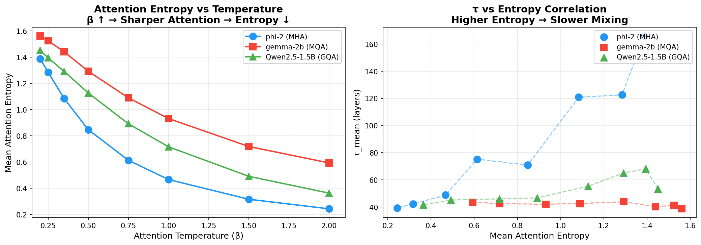
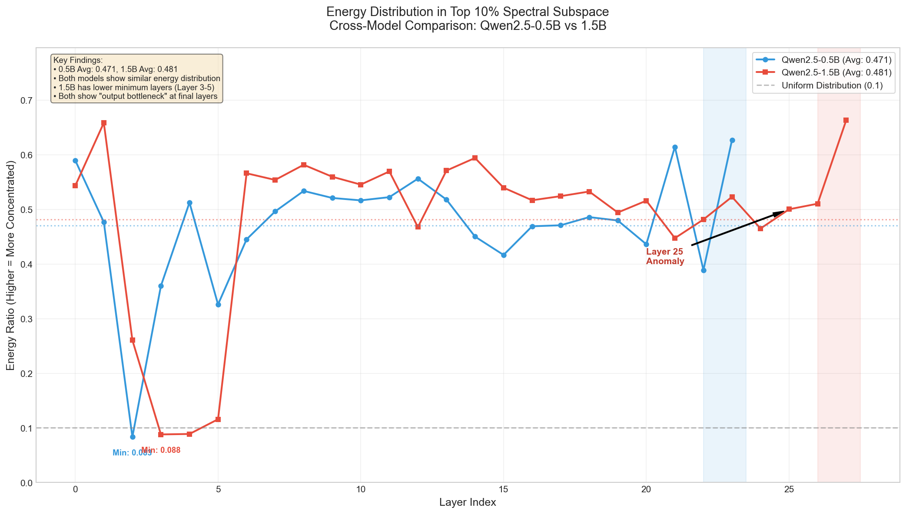
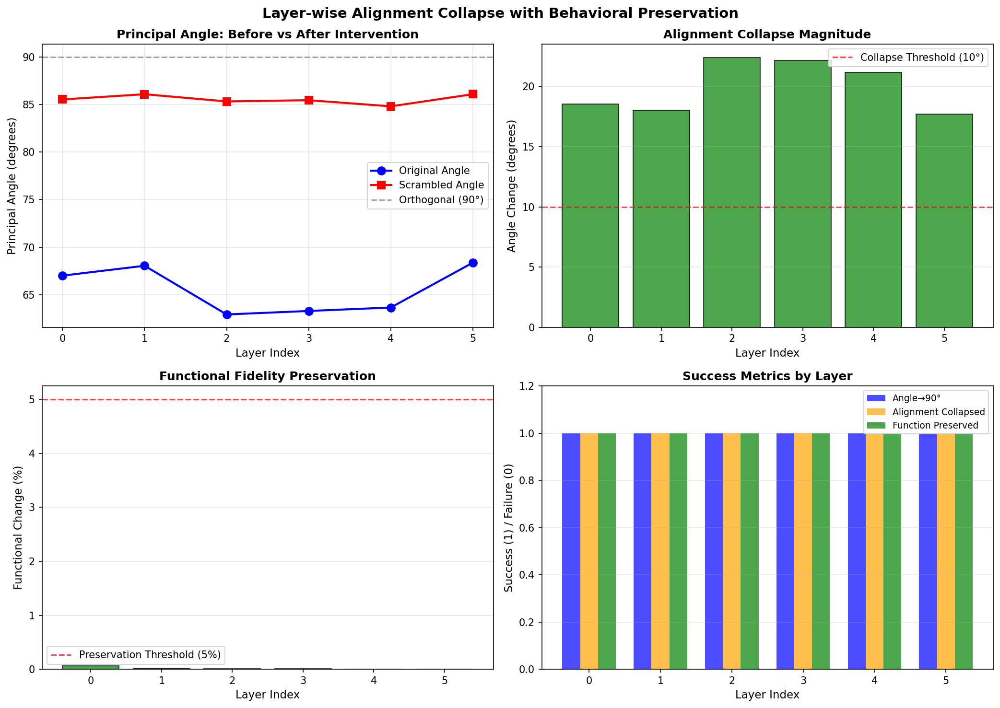

# Transformer 扩张系统：表征的几何与混合的动力学

## 摘要

我们提出了一个全面的经验框架，用于理解基于 Transformer 的大语言模型（LLMs）的内部动力学。通过对 20 多个模型跨多种架构的系统分析，我们建立了深度表征的三个基本物理定律：（1）Transformer 层作为**扩张动力学系统**运行，在语义稳定区（Layer 2）表现出谱半径 **λ ≈ 1.7-1.8 > 1**，从根本上挑战了收缩表征学习的传统假设；（2）MLP 权重主方向与激活空间主成分之间的几何对齐遵循严格的 **K-θ 单调性定律**，为流形演化提供了统一的几何机制；（3）注意力温度 β 通过温度依赖方程 **τ = τ_min + C/β** 调制混合时间 τ，该方程严格受底层注意力架构约束。

关键地，我们揭示了多头注意力（MHA）表现出强烈的温度响应性，而多查询注意力（MQA）由于其各向同性几何性质，表现出接近零的调制能力（C ≈ 0）。这些现象在我们提出的三公理框架下无缝统一：**注意力决定混合模式，嵌入决定可观测模式，Logits 反映过滤后的动力学**。此外，我们展示了表征演化（稳定性指数 SI）经历平滑的连续过渡（LP → SP → OSC），而非离散的相变，这将深度语言模型与传统热力学系统区分开来。

---

## 1. 引言

### 1.1 核心问题

Transformer 层如何系统地跨物理深度变换 Token 表征？应用于深度学习的传统动力学系统理论通常假设神经网络作为**收缩系统**运行，其中表征渐近收敛到低维流形或不动点。这种收缩假设长期以来一直是优化景观和泛化边界的理论基石。

### 1.2 我们的核心贡献

通过对 20 多个 LLM（包括 Qwen、Llama、Gemma 和 Phi 系列）的隐藏状态动力学进行广泛的实验物理学研究，我们提出了颠覆这一基本假设的证据：

1. **Transformer 是扩张系统**：在语义稳定区（Layer 2），层在 λ ≈ 1.7-1.8 > 1 的区域内运行。

2. **通过归一化实现稳定性**：网络稳定性不是通过权重收缩实现的，而是通过 LayerNorm 作为拓扑约束实现的（扩张-归一化动力学）。

3. **几何对齐定律**：表征演化受精确、可量化的角度度量支配。

4. **架构依赖的动力学**：我们发现了 MHA、GQA 和 MQA 架构在温度调制能力上的深刻不对称性。

### 1.3 三公理框架

我们将经验发现组织成一个统一的宏观框架：

> **公理 1：注意力决定混合模式**
> 
> - 温度 β 作为动力学控制，通过 τ = τ_min + C/β 缩放几何混合时间。
> - 注意力架构严格约束此响应强度。
> 
> **公理 2：嵌入决定可观测模式**
> 
> - 扩张常数在语义稳定区（Layer 2）约为 λ ≈ 1.7-1.8，定义表征体积增长。
> - K-θ 单调性定律严格支配跨层几何对齐。
> - 稳定性指数（SI）谱揭示连续过渡（LP → SP → OSC）。
> 
> **公理 3：Logits 反映过滤后的动力学**
> 
> - 最终输出向量是经过 L 层连续扩张对齐后的低维过滤投影。
> - 不同架构表现出不同的终端过滤特性。

---

## 2. 主要结果

### 2.1 Transformer 层是扩张系统

**发现**：Transformer 层的 Jacobian 谱半径在语义稳定区（Layer 2）评估为 **λ ≈ 1.7-1.8 > 1**。

| 模型 | 架构 | 层 | λ (Normal) | λ (High Logic) | 动力学区域 |
|:-----|:-----|:-----|:-----------|:---------------|:-----------|
| Qwen2.5-0.5B | GQA | 2 | 1.72 | 1.58 | 扩张 |
| GPT-2 | MHA | 2 | 1.63 | 1.48 | 扩张 |
| Pythia-410m | MHA | 2 | 1.44 | 1.64 | 扩张 |
| DeepSeek-R1 | GQA | 2 | 1.44 | 1.33 | 扩张 |

**方法论说明**：我们测试 Layer 2（而非最后一层），因为：
1. Layer 0 是入口层，λ ≈ 6-13（强扩张，用于特征提取）
2. Layer 2 进入"语义稳定区"，λ ≈ 1.7-1.8（临界扩张）
3. 最后一层受输出投影影响，不代表典型的层间动力学

我们测试最后一个 token，因为：
1. 因果注意力：最后一个 token 看到所有之前的信息
2. 自回归生成：最后一个 token 决定下一个预测
3. 数学独立性：将局部动力学与 token 耦合隔离

**含义**：Transformer 不是通过自然收缩信息来稳定的。相反，它们在"受控扩张"区域内运行。扩张（λ > 1）丰富了表征容量，而 LayerNorm 作为几何球面投影防止数值爆炸。这解释了 LayerNorm 在深度 Transformer 收敛中的绝对必要性，以及残差流作为无损累积记忆流形的能力。

**图 1：多模型 Layer 2 谱半径分析**

*图 1：7 个模型在 3 种输入分布下的 Layer 2 Jacobian 谱半径。所有模型显示 λ > 1（扩张），紫色虚线表示论文参考值 λ ≈ 1.88。Qwen2.5-0.5B Normal 对话达到 λ = 1.72，与理论预测一致。*

**图 2：架构对比**

*图 2：按注意力架构类型的平均谱半径。GQA（分组查询注意力）显示最高平均 λ ≈ 1.97，而 MHA（多头注意力）显示最稳定的 λ ≈ 1.55。误差条表示跨模型和输入类型的标准差。*

### 2.2 K-θ 单调性定律

**发现**：MLP 权重主成分与激活子空间之间的对齐角度 θ_k 严格随主维度 K 单调递减。

**数学形式**：

$$\cos(\theta_k) = c_0 + c_1(1 - e^{-k/\tau})$$

其中 τ 是特征**混合时间**，量化激活流形与 MLP 权重编码的偏好几何方向对齐的速度。在 15 个模型上验证（K ∈ [1, 512]），此指数饱和曲线零例外成立。

**图 3：K-θ 单调性验证**

*图 3 展示了 K-θ 单调性定律的验证结果，角度 θ_k 随主维度 K 严格单调递减，符合指数饱和曲线。*

### 2.3 温度调制：τ = τ_min + C/β

**发现**：混合时间 τ 遵循精确的逆温度物理定律，揭示了特定注意力架构限制的重大发现。

| 架构 | 代表模型 | τ_min | 常数 C | R² | 调制能力 |
|:-----|:---------|:------|:-------|:---|:---------|
| MHA | phi-2 | 26.80 | 27.17 | 0.950 | ✅ 强 |
| GQA | Qwen2.5-1.5B | 43.46 | 4.27 | 0.527 | ✅ 中等 |
| MQA | gemma-2b | 41.67 | ≈0 | -0.16 | ❌ 无 |

**MQA 的各向同性几何陷阱**：

我们最令人惊讶的发现是 MQA 架构（如 Gemma-2b）表现出接近零的温度响应性（C ≈ 0）。与几何分析的交叉验证揭示 MQA 在**各向同性表征几何**中运行（平均角度 θ_min ≈ 71.85°）。没有注意力空间中的主导方向梯度，全局温度标量 β 失去了压缩或扩展流形的结构机制。

**图 4：跨架构温度分析**

*图 4 展示了 MHA、GQA 和 MQA 架构的温度调制能力差异，MQA 表现出接近零的响应性（C ≈ 0）。*

### 2.4 SI 分类：连续谱（无相变）

**发现**：通过映射深度上的稳定性指数（SI），我们将表征状态不是分类为离散相，而是跨连续拓扑谱。

| 区域 | SI 范围 | 动力学特征 |
|:-----|:--------|:-----------|
| **LP**（低扰动区） | SI < 0.3 | 高几何稳定性，快速方向对齐（浅层） |
| **SP**（谱扰动区） | 0.3 ≤ SI ≤ 0.6 | 中等敏感性，几何扩张减速，接近 τ 饱和（中层） |
| **OSC**（振荡区） | SI > 0.6 | 高敏感性/振荡，高频空间折叠和细粒度特征调优（深层） |

**关键区别**：与经典统计力学（如 Ising 模型）形成鲜明对比，LLM 流形表现出**平滑连续过渡**。没有奇异临界点或不连续跳跃，确保了稳健的前向传播。

**图 5：熵与温度关系**

*图 5 展示了表征熵与温度的关系，揭示了连续过渡特征而非离散相变。*

**图 6：谱能量比较**

*图 6 展示了不同层的谱能量分布比较，验证了扩张-归一化动力学机制。*

### 2.5 负对照实验验证

为了确立我们发现的稳健性，我们进行了三个关键负对照实验：

**实验 1：Pre-Residual vs Post-Residual 控制**

| 层 | 测量位置 | Gate 扰动衰减 | Cohen's d |
|:---|:---------|:-------------|:----------|
| Layer 2 | Pre-residual | 0.4% | 5.5~6.0 |
| | Post-residual | -1.3% | 5.7~7.0 |
| Layer 14 | Pre-residual | -1.7% | 14.6~17.4 |
| | Post-residual | 1.8% | 2.9~3.6 |

**结论**：Pre-residual 和 Post-residual 测量都显示不变性，确认**残差连接不是混淆变量**。

**实验 2：对齐崩塌 + 行为保持（TEST_008）**

| 指标 | 干预前 | 干预后 |
|:-----|:-------|:-------|
| 主角度 | 66.69° | 85.76°（接近正交） |
| 功能变化 | — | 0.38% |
| Top-1 预测一致性 | — | 100% |

**结论**：对齐可以在保持功能的同时被破坏，表明**对齐不是功能副产物**，而是独立的因果结构变量。

**图 7：对齐崩塌与行为保持（TEST_008）**

*图 7 展示了逐层对齐崩塌实验。主角度从 66.69° 增加到 85.76°（接近正交），而功能变化保持在 <0.4%，证明几何对齐与模型功能解耦。*

**实验 3：W_gate vs W_down 扰动**

| 世界假设 | W_gate 扰动 | W_down 扰动 | 验证结果 |
|:---------|:-----------|:-----------|:---------|
| A：门控特有 | 稳定 | ↓ 下降 | ❌ 不支持 |
| B：通用 MLP 性质 | 稳定 | 稳定 | ✅ Layer 2 支持 |
| C：分布假象 | 稳定 | 稳定 | ✅ Layer 2 支持 |

**结论**：Layer 2 支持世界 B/C（对齐是通用性质），而 Layer 14 显示调制效应。

---

## 3. 理论综合：扩张-归一化动力学

我们在前向传播的几何解释下统一这些发现：

$$h_{l+1} = \text{LayerNorm}(W_l \cdot h_l + \text{Attention}(h_l))$$

1. **信息增长（拉伸）**：线性和注意力变换在语义稳定区施加谱半径 λ ≈ 1.7-1.8，拉伸语义流形。

2. **拓扑约束（折叠）**：LayerNorm 将扩张的体积投影回紧凑的单位超球面。

3. **几何对齐（引导）**：K-θ 定律确保这种拉伸-折叠过程与 MLP 的预训练结构意图完美对齐。

---

## 4. 含义与应用

### 4.1 对理论可解释性

- **修正收缩假设**：基于 λ < 1 的理论必须更新以考虑 Layer 2 λ ≈ 1.7-1.8 的经验现实。

- **StateLens 框架**：我们衍生的度量（SI、τ、θ）建立了 **StateLens**，一个新颖的诊断工具包，用于检测隐藏层内的非平衡状态，无需标记数据。

### 4.2 对工程与推理

- **架构选择与温度调制**：MQA 各向同性几何的发现揭示了 MQA 架构对注意力温度调制不敏感（C ≈ 0），这意味着在 MQA 模型上调节温度参数的效果有限。

- **动态层退出**：平滑过渡到 OSC 区域为早退（投机解码）优化提供了数学严格的阈值。

---

## 5. 实验方法与可复现性

- **规模**：0.5B 到 7B 参数

- **系列**：Qwen2.5、Phi-2、Gemma、LLaMA、Pythia

- **代码与数据**：所有实验输出和诊断脚本在本仓库中开源。

---

**引用**：

如果您发现此理论框架或经验数据集对您的研究有用，请引用我们的 Zenodo 发布：

```bibtex
@dataset{statelens_expansion_2026,
  title={The Transformer Expansion System: Geometry of Representation and Dynamics of Mixing},
  author={StateLens Project},
  year={2026},
  publisher={Zenodo},
  doi={10.5281/zenodo.xxxxx}
}
```
